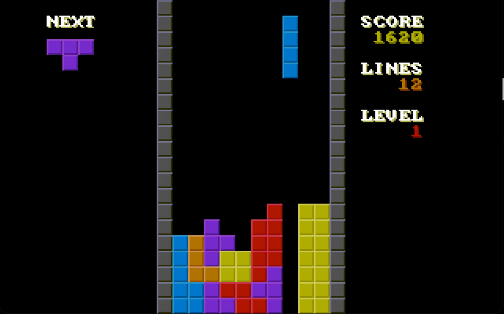

# TETRIS-OS: An operating system that only plays Tetris.



#### Features:
- It's Tetris.
- 32-bit (x86)
- Fully custom bootloader
- Soundblaster 16 driver
- Custom music track runner
- Fully hardcoded tetris theme
- Double-buffered 60 FPS graphics at 320x200 pixels with custom 8-bit RGB palette

#### Resources Used
- [osdev.org wiki](https://wiki.osdev.org/Main_Page)
- [Sortix](https://sortix.org)
- [ToaruOS](https://toaruos.org)
- [James Molloy's Kernel Development Tutorials](http://www.jamesmolloy.co.uk/tutorial_html/)

#### Running
**NOTE**: This has *only* been tested in an emulator. Real hardware might not like it.

##### Mac OS
```
$ make iso
$ qemu-system-i386 -drive format=raw,file=boot.iso -d cpu_reset -monitor stdio -device sb16 -audiodev coreaudio,id=coreaudio,out.frequency=48000,out.channels=2,out.format=s32
```

##### Unix-like
Use the same command as Mac OS, but try with `pulseaudio` as the audio device.

##### Windows
Absolutely no idea.

##### Real hardware
You probably know what you're doing if you're going to try this. Just burn `boot.iso` onto some bootable media and give it a go. If things break, try disabling all of the music since you *probably* don't have something with a SB16 in it.
